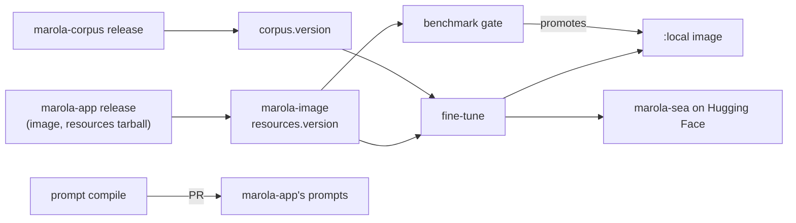

# Design

marola-ml does three jobs, and none of them is on the request path. When the app answers a
question it runs no Python: it replays two JSON prompts and calls a model Ollama serves. This repo
produces those prompts and that model, and decides whether a model is good enough to ship.

| Job | Code | Produces | Runs when |
|---|---|---|---|
| The prompt compile | `dspy/compile_recommendation_prompt.py` | `recommendation_prompt.json`, `review_prompt.json`, as a PR to marola-app | by hand: `just compile-prompt` or a `compile-prompt.yml` dispatch |
| The fine-tune | `finetune/` | Tier 1: `marola-llama3.2`, an Ollama Modelfile, no weights changed. Tier 2: marola-sea, a QLoRA + DPO model published to Hugging Face | Tier 1: `just finetune-model`, and every `Dockerfile.local` build; Tier 2: by hand, a `marola-sea-publish.yml` dispatch |
| The benchmark gate | `scripts/benchmark.sh`, `scripts/benchmark_gate.py`, `docs/benchmarks/` | the decision to move `ghcr.io/marola-dev/marola-ml:local` | `docker-local.yml`, on a push to main touching the model, the pins or the gate |

## Where each job's details live

- [The prompt compile](3-development_prompt-compile.md): the two signatures, the cost of an LLM in
  the loop, Langfuse and MLflow.
- [The fine-tune](3-development_finetune.md): the tiers, the preset ladder, preflight, merge,
  publish and the licences that follow a base model.
- [The benchmark gate](3-development_benchmark-gate.md): what it compares, the embedder gap,
  re-baselining.

## Patterns

- **Pinned releases, never another repo's tree.** The app image (`marola-image`, a tag and its
  digest), the app's resources tarball (`resources.version`) and the corpus (`corpus.version`).
  `scripts/corpus-fetch.sh` and `scripts/resources-fetch.sh` unpack the last two into
  `.tmp/knowledge` and `.tmp/resources`. The benchmark is the pinned app image's `--benchmark`;
  nothing here builds the app.
- **The standard library by default.** Torch, transformers, peft and trl sit behind lazy imports
  in `finetune/`, so every script's `--self-test`, the dataset builders and the gate run on a bare
  Python 3.12. DSPy is the compile's own dependency (`dspy/requirements.txt`).
- **A self-test per script.** Each one has `--self-test`, and `just quality` runs them all. A
  dataset builder or the gate reads its input after fetching it and fails on an empty one.
- **One run directory per base model.** Training writes under `finetune/out/<preset>/`, and each
  script refuses an output or an adapter that belongs to another base, before importing torch.
- **Irreversible steps are a human's.** A Hugging Face upload, from `just finetune-publish` or a
  dispatched `marola-sea-publish.yml` run (which also tags `marola-sea-v<N>`), is started by a
  person ([who may run what](3-development.md#cost-and-who-may-run-what)).

## Module map

| Path | What it is |
|---|---|
| `dspy/compile_recommendation_prompt.py` | the two DSPy signatures, their trainsets and metrics, the compile |
| `finetune/Modelfile`, `finetune/Modelfile.adapter` | Tier 1's persona on `llama3.2`; Tier 2's adapter on its base |
| `finetune/build_dataset.py`, `finetune/build_dpo_dataset.py` | the SFT set and the DPO pairs, from the pinned resources and corpus |
| `finetune/preflight.py` | VRAM, RAM, disk and a rough ETA for a preset on this machine |
| `finetune/train_lora.py`, `finetune/train_dpo.py` | QLoRA SFT, then DPO on top of it; `train_lora.py` holds `PRESETS` |
| `finetune/merge_export.py`, `finetune/publish_hf.py` | merge into the base, GGUF export and quantization; the Hugging Face upload |
| `scripts/benchmark.sh`, `scripts/benchmark_gate.py`, `scripts/app-image.sh` | run the pinned app's `--benchmark`, gate the report, read the pin |
| `scripts/corpus-fetch.sh`, `scripts/resources-fetch.sh` | unpack the pinned releases into `.tmp/` |
| `scripts/analyze_training.py`, `scripts/marola-sea-pull.sh` | a training run's report; pull the published model into Ollama |
| `scripts/api-docs.sh` | pdoc of `finetune/` and `scripts/` |
| `Dockerfile.local` | Ollama with `marola-llama3.2` and `nomic-embed-text:v1.5` in its store |
| `docs/benchmarks/` | the kept benchmark runs the gate compares against |
